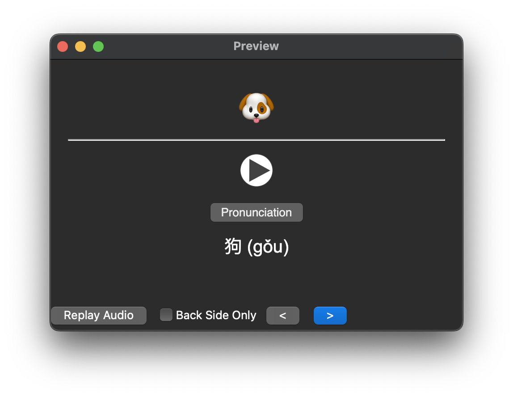

# Emoji Language Flashcards

Emoji Language Flashcards are a set of emoji-translation-mp3 pairings that can be used to learn language vocabulary. Emoji Flashcards are meant to be used at the beginning of language learning, in order to give some confidence in vocabulary and to act as a supplement for additional more language-specific learning. These are not intended to be a list of "most common words", but rather are a list of pictographic words that are hopefully fairly translatable across many languages and cultures.

## Language Data Files Spec

Language data is stored in JSON in the `data` directory. `extensions` of the same name and file format can be used to "extend" specific languages with words that may be useful in those languages.

### File Naming

Language files should be named via 2-part [language tag](https://www.rfc-editor.org/rfc/rfc5646.html#section-2.1). Specifically, we are using [a ISO 639-1 OR ISO 639-3 code](https://en.wikipedia.org/wiki/List_of_ISO_639-1_codes) (if a 2-digit ISO 639-1 is not specific enough for common understanding) and [ISO 3166-1 code](https://www.iso.org/obp/ui/#search/code/) (again, shortest. So Probably Alpha-2 code) joined by a `-` and appended with `.json`:

Examples:

- `en-US.json` English - United States of America (the)
- `es-MX.json` Spanish - Mexico
- `es-ES.json` Spanish - Spain
- `zh-CN.json` Chinese - China
- `zh-TW.json` Chinese - Taiwan
- `yue-CN.json` Yue Chinese - China

#### Extension File Naming

Extensions are named the same way, with the additional flexibility of using language-only filenames (`en.json` or `ja.json`). These can extend all language files of all country codes (`es.json` will extend `es-ES.json` and `es-MX.json`).

Notes:

1. There is NO concept of "cross-region" extensions (`CN.json` will not extend `[xx]-CN.json`).
2. More specific extensions will override more general ones on a word-by-word basis:

- If a word exists in only `extensions/es.json`, it will extend `data/es_MS.json`.
- If a word exists in only `extensions/es-MX.json`, it will extend `data/es_MS.json`.
- If a word exists in BOTH `extensions/es.json` and `extensions/es-MX.json`, `extensions/es-MX.json` will extend `data/es_MS.json`

Examples:

- `en-US.json` English - United States of America (the)
- `es.json` Spanish (All spanish-speaking countries)
- `es-MX.json` Spanish (only Mexico. Individual words override `es.json`)

### File Structure

```jsonc
{
  /* Strings for the website */
  "strings": {
    "title": "表情符號語言抽認卡",
    "description": "可下載的表情符號抽認卡以學習多種語言",

    /* Translations for all the languages for the selector */
    "en-US": "英文 （美國）",
    "ch-ZH": "中文 （台灣）"
  },

  /* Map of all emoji data, keyed by emoji to enforce one-of-a-kind */
  "data": {
    "🐶": {
      "text": "dog", /* Translated text */

      /* Data: Audio Name  */
      /* Audio location is expanded for file location at DL runtime */
      "audio": "🐶.mp3",

      /* Data: Category Key */
      /* Category keys are translated to user-language at DL runtime */
      "category": "animal",

      /* A broad "anything goes" field that is hidden until clicked */
      /* This example is pinyin. Another might be gender for es or fr nouns */
      "hint": "gǒu"
    }
  }
}
```

### Audio

Still need to sort out where this will be stored (not in this repo, for size concerns). Expect general TTS to be pulled from [Forvo](https://api.forvo.com/) or generated via [Google TTS](https://cloud.google.com/text-to-speech). Maybe at some point, we can replace our own audio.

## Anki Deck

Our data is able to be formatted into Anki tsv files. These will be generated and cached on the fly by updated our data json files with the user's language (for categories).

### Card Template

We will also have a card template. Each data point has 3 different types of card:

1. Audio only (+ hidden hint)
2. Emoji only (No hint available)
3. Text only (No hint available)

The answer will always show all of Audio, Emoji, Text, and Hint:



## Using the code in this Repo

Built using [Deno](https://deno.com).

## Other Similar Resources

- [Unicode Emoji List](https://unicode.org/emoji/charts/full-emoji-list.html)
- [Frequency Lists](https://en.m.wiktionary.org/wiki/Wiktionary:Frequency_lists/English)
- [Gabriel Wyner's "625 Words"](https://fluent-forever.com/wp-content/uploads/2014/05/625-List-Thematic.pdf)
- [HSK (漢語水平考試)](https://mandarinbean.com/new-hsk-vocabulary/)
