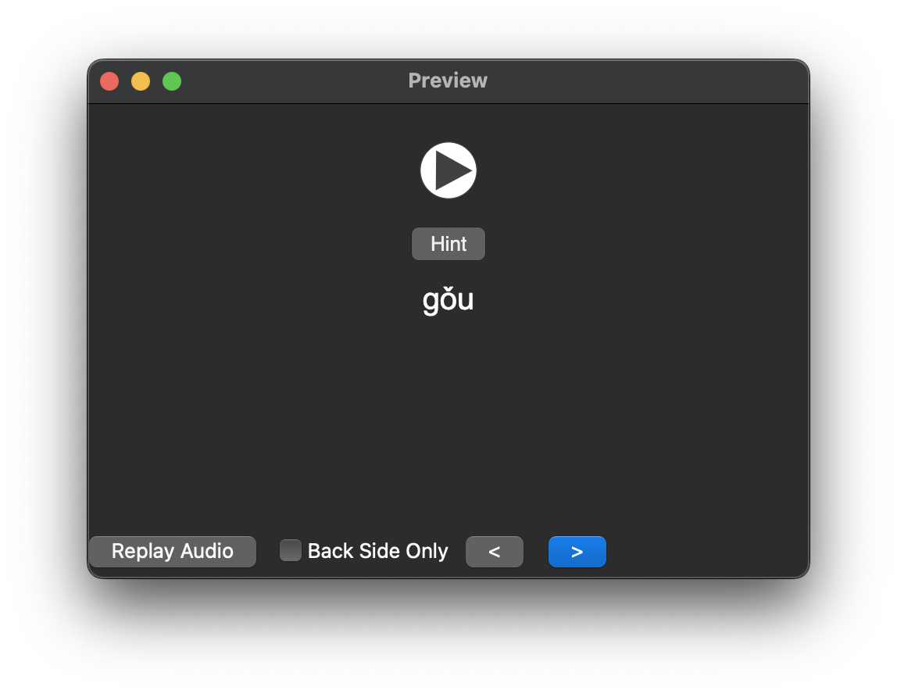
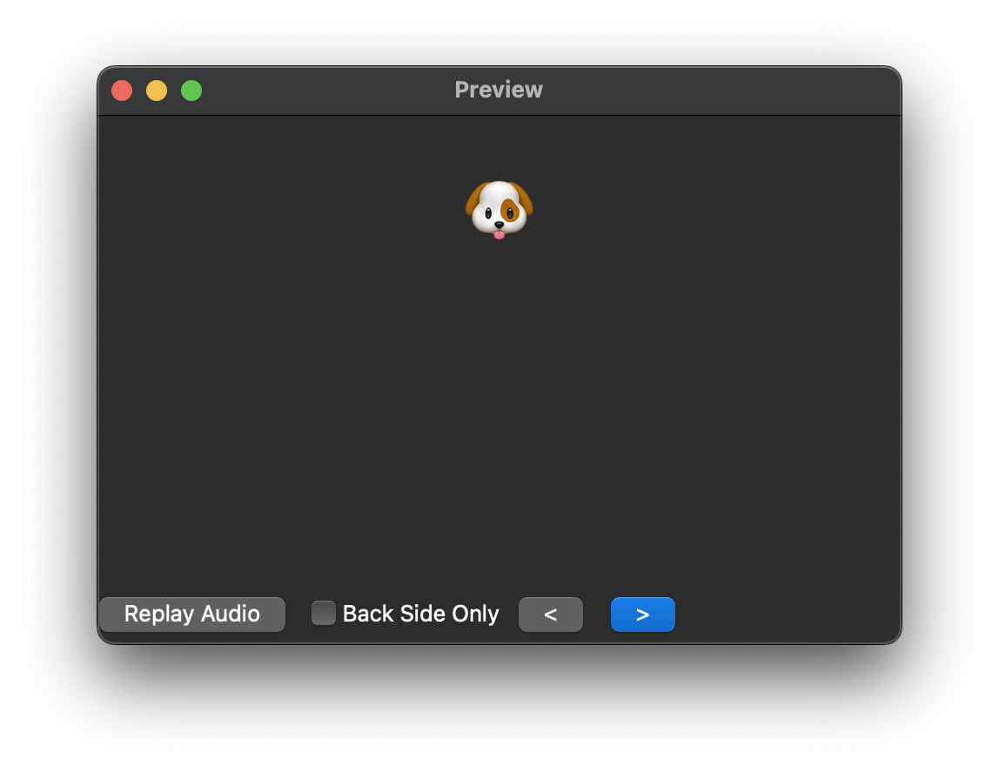
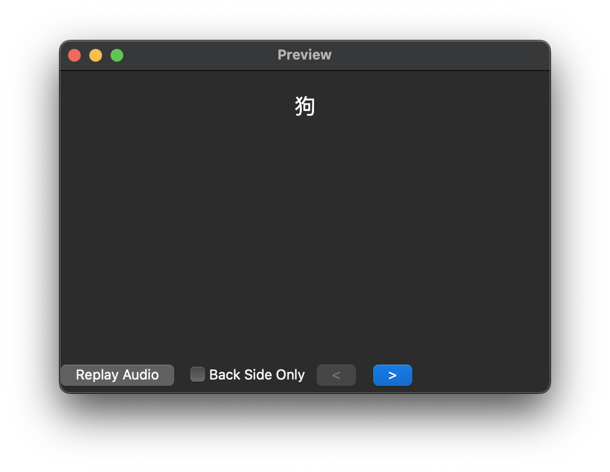

# Templates

## Question

Each Anki note has 3 different types of card questions:

1. Audio only (+ hidden hint if available)
2. Emoji only (No hint available)
3. Text only (No hint available)

### Audio Template

### Emoji Template

### Text Template

## Answer

The answer will always show all of Audio, Emoji, Text, and Hint:

