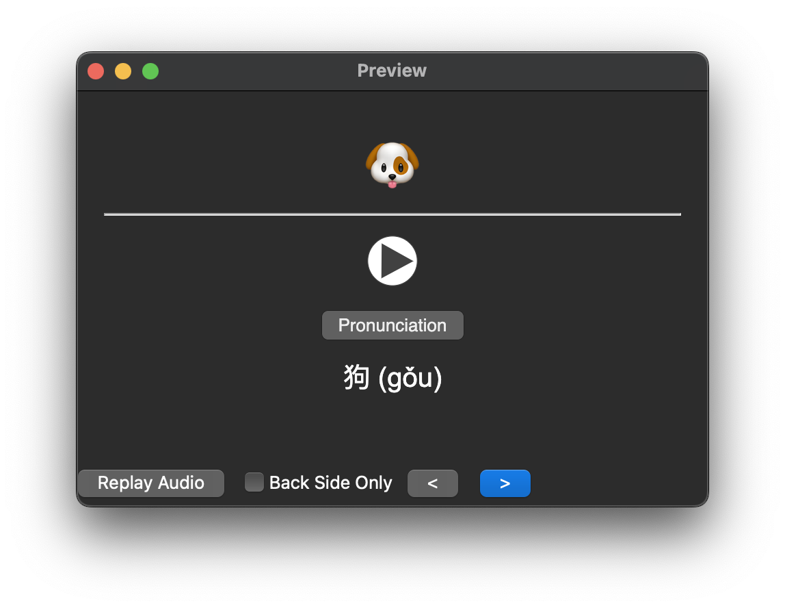

### Templates

Each Anki note has 3 different types of cards:

1. Audio only (+ hidden hint)
2. Emoji only (No hint available)
3. Text only (No hint available)

The answer will always show all of Audio, Emoji, Text, and Hint:

